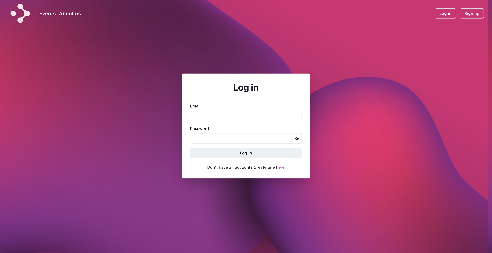
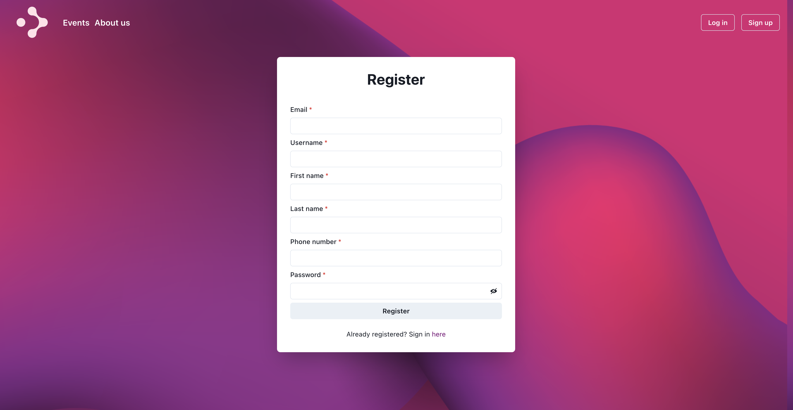

# Final React Project

## Getting started

Clone the repository
2. Navigate to the repository
3. Open terminal and:
   - run **npm install** to install the project dependencies
   - **npm run dev** dev in order to start the app in development mode
   - 
   - **hosting**: https://final-react-project-f8e7f.web.app/

# Deep Connection React Project

Welcome to the Deep Connection React project! This project aims to provide a platform that helps you organize your day, prioritize wellness and mindfulness, and connect with like-minded individuals for meaningful interactions. This README will guide you through the project's structure, features, and how to set it up.

## Features

Deep Connection offers a wide range of features to help you plan your day, improve your well-being, and foster meaningful connections:

-   **Personal Planner:** Schedule your daily tasks and events.
-   **Mindfulness Events:** Join mindfulness events such as yoga, meditation, and nature activities.
-   **Calendar Views:** Use Month, Week, and Day views to manage your schedule.
-   **Event Management:** Create public or private events, set event repetition, upload pictures, and choose event colors.
-   **Events List:** Access public, private, and personal events.
-   **Event Invitations:** Invite people to your events, and receive notifications.
-   **Daily Horoscope and Quotes:** View your horoscope and receive random personal quotes with images.
-   **Member Management:** Add and connect with other members.
-   **Contact Lists and Groups:** Create contact lists and groups for easy event invitations.
-   **Event Invitations:** Invite people to your events, and receive notifications.
-   **Profile Customization:** Edit your profile, share a description, personal slogan, and picture.
-   **Rich Text Formatting:** Use Quill library to format text in descriptions and event details.
-   **Social Media Integration:** Add social media links to connect with like-minded individuals.
-   **Reminders:** Receive reminders for upcoming events.
-   **Notifications:** Receive notifications for event invites and reminders.
-   
## Visuals ( PC )

### Home ( Public part )

### Trending Events ( Public part )

### Our Mission ( Public part )

### Login

### Register

### Events list

### Calendar ( Month view )

### Calendar ( Week view )

### Calendar ( Day view )

### Create event 

### Edit event 

### Event detailed

### My profile

### Edit my profile ( Avatar )

### Contact list

### Members

### About us

### To Dos

